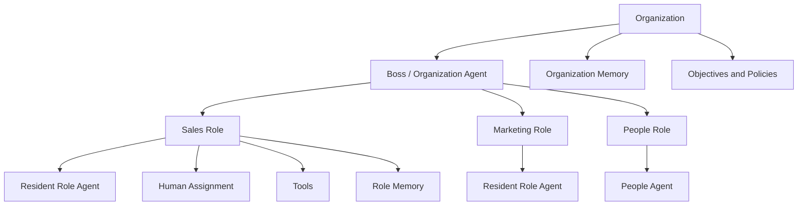

# Born-Agentic Organization

> **Roles exist before employees. Agents start working before humans are hired.**

Born-Agentic Organization is a Role-first organizational model for AI-native companies.

The persistent unit of the organization is the Role —
not the Employee, not the Agent, and not the Model.

Role Agents can begin working before humans are hired,
detect capability gaps,
request human collaborators,
and preserve organizational memory across employee turnover.

**Status:** v0.1 — Concept & Architecture Draft · 2026-09-11 · [中文说明](README.zh-CN.md)

---

## The question this project asks

Most enterprise AI work starts from an organization that already exists. People, departments, processes, software and habits are already in place. AI arrives last, and its value depends on people voluntarily changing established behavior.

Born-Agentic Organization starts somewhere else:

> If we were designing a company from scratch for the Agent era, why would we first build a human-centered organization and only then add AI?

The hypothesis:

> **The persistent unit of an organization is the Role.**

Human, Agent, Model and Tool are all resources that attach to a Role for a period of time. The Role outlives every one of them.

## What this is, and what it is not

| This is | This is not |
|---|---|
| An organizational model | AI HR SaaS |
| A reference architecture | An "AI employee" platform |
| A specification for a future runtime | A chatbot for employees |
| A public concept and discussion record | A workflow builder or automation tool |
| A proposal for **Role-first** design | A multi-agent demo |
| A claim that humans stay accountable | A claim that AI replaces everyone |

## Core Principles

1. **Role First** — Roles exist before employees. Create the Role, then decide who or what fills it.
2. **Agent Before Human** — A Role Agent may begin operating before any human is assigned to the Role.
3. **Capability Before Headcount** — Determine which capabilities the objective requires before deciding whether a Human is needed at all.
4. **Machine-Initiated Hiring** — After detecting a persistent Capability Gap, a Role Agent may request a human collaborator.
5. **Human Assignment** — A Human is not permanently bound to an Agent. A Human enters a Role through an Assignment.
6. **Persistent Organizational Memory** — When a Human leaves, the Role's memory, state and decision history do not disappear.
7. **Human Accountability** — Agents may plan, execute and recommend, but high-impact hiring, termination, legal, financial and safety decisions remain under explicit human accountability.

## The Model

```text
Organization
│
├── Objectives
│
├── Boss / Organization Agent
│
└── Roles
     │
     ├── Role Identity
     ├── Objectives & KPIs
     ├── Authority & Policies
     ├── Memory & State
     ├── Decision History
     ├── Tools & Resources
     │
     ├── Resident Role Agent
     ├── Human Assignments
     └── Temporary / Specialist Agents
```



The Organization holds objectives, policies and global memory. The Boss / Organization Agent decomposes objectives and creates Roles. Each Role then owns its own identity, authority, memory and state, and attaches its own resources — a resident Role Agent, zero or more Human Assignments, tools and specialist Agents.

See [architecture/DIAGRAMS.md](architecture/DIAGRAMS.md) for the full diagram set, and [architecture/OVERVIEW.md](architecture/OVERVIEW.md) for services, runtime loop and the reference stack.

## The inversion

```text
Traditional company:
Human → Role → Work → Knowledge stays with the Human

Born-Agentic organization:
Role → Agent starts work → Capability Gap → Human joins the Role
```

## Capability Gap and Capability Allocation

A Role continuously compares what its objectives require against what is actually available:

```text
Required Capabilities
- Available Agent Capabilities
- Available Human Capabilities
- Available Tool / Vendor Capabilities
= Capability Gap
```

For each material gap the organization evaluates, in order:

```text
Build → Buy → Automate → Delegate → Outsource → Assign Existing Human → Hire New Human
```

Hiring is therefore **one** capability acquisition mechanism among several, not the default response. Headcount becomes an output of Capability Allocation rather than its starting point.

See [spec/CAPABILITY_MODEL.md](spec/CAPABILITY_MODEL.md).

## Example: North America Business Development

A company creates a Role:

```text
ROLE-00017
North America Business Development
```

Before any salesperson is hired, the Role Agent can research markets, identify prospects, maintain CRM state, draft outreach, prepare meetings, analyze pipeline and preserve customer history.

After operating for a period, it may discover a Capability Gap:

```text
Capability Gap
- complex negotiation
- trust building
- offline relationship management
```

Now the Role can request:

> I need a human collaborator with these capabilities.

A People Agent sources candidates. The Role Agent participates in role-specific interviews using real work simulations, because it owns the actual work context. Once a Human is hired:

```text
EMP-00891
    ↓
ASSIGN-02831
    ↓
ROLE-00017
```

The employee enters an already-running Role — with live objectives, current pipeline, prior strategy, failed experiments and pending work — instead of starting from an empty workstation.

See [docs/CONCEPT.md](docs/CONCEPT.md) for the full worked model.

## Terminology

These terms are used with the same meaning across every document in this repository.

| Term | Definition |
|---|---|
| **Born-Agentic Organization** | A Role-first organizational model for AI-native companies, in which Roles persist and Human/Agent/Model resources attach to them. |
| **Role-first** | Designing the organization around persistent Roles rather than around employees, agents or models. |
| **Role Agent** | The persistent cognitive executor attached to a Role. Replaceable without terminating the Role. |
| **Role** | The persistent organizational unit. Owns mission, objectives, KPIs, authority, policies, memory, state and decision history. |
| **Capability Gap** | Required capabilities minus the capabilities currently available from Agents, Humans, tools and vendors. |
| **Machine-Initiated Hiring** | A Role Agent detecting a persistent Capability Gap and generating a Hiring Request without a human initiating it. |
| **Human Assignment** | The object connecting a Human to a Role. Ending an Assignment does not delete the Role or its memory. |
| **Active Organizational Memory** | Memory that proactively informs current action, not a passive store consulted only on demand. Scoped as Organization, Role, Entity, Working and Decision Log. |
| **Capability Allocation** | Allocating capabilities — Agent, Model, API, software, vendor, freelancer, Human — rather than allocating headcount. |
| **People Agent** | The organizational capability service that converts a Capability Gap into a candidate profile and manages sourcing, screening and assignment. |

## Repository map

| Document | What it covers |
|---|---|
| [README.zh-CN.md](README.zh-CN.md) | 中文说明 |
| [docs/MANIFESTO.md](docs/MANIFESTO.md) | Nine theses behind the model |
| [docs/CONCEPT.md](docs/CONCEPT.md) | Concept, abstractions, Capability Gap, Assignment, memory |
| [docs/WHITEPAPER.zh-CN.md](docs/WHITEPAPER.zh-CN.md) | 原生 Agent 组织白皮书草案 |
| [architecture/OVERVIEW.md](architecture/OVERVIEW.md) | Reference architecture v0.1 — services, runtime loop, stack |
| [architecture/DIAGRAMS.md](architecture/DIAGRAMS.md) | Mermaid diagrams with text explanations |
| [spec/ROLE_OBJECT.md](spec/ROLE_OBJECT.md) | Role Object Specification v0.1 |
| [spec/ROLE_LIFECYCLE.md](spec/ROLE_LIFECYCLE.md) | Role Lifecycle v0.1 |
| [spec/CAPABILITY_MODEL.md](spec/CAPABILITY_MODEL.md) | Capability Model v0.1 |
| [spec/ASSIGNMENT_OBJECT.md](spec/ASSIGNMENT_OBJECT.md) | Assignment Object Specification v0.1 |
| [spec/EVENT_MODEL.md](spec/EVENT_MODEL.md) | Event Model v0.1 |
| [GOVERNANCE.md](GOVERNANCE.md) | Minimum governance principles |
| [ROADMAP.md](ROADMAP.md) | Phase 0 through Phase 6 |
| [PUBLICATION.md](PUBLICATION.md) | Public concept version and timestamp record |
| [NOTICE.md](NOTICE.md) | Scope and prior-art statement |
| [CONTRIBUTING.md](CONTRIBUTING.md) | How to contribute |
| [CITATION.cff](CITATION.cff) | How to cite this work |

## Roadmap

**Phase 0 — Public Concept (current).** Manifesto, concept model, reference architecture, Role Object, Capability Model and Role Lifecycle spec v0.1.

**Phase 1 — Runtime Skeleton.** Organization object, Role CRUD, Role state, resident Agent binding, event log, decision log, Human assignment.

**Phase 2 — One Real Role.** North America BD reference role with research, CRM, email and durable task execution.

**Phase 3 — Capability Engine.** Capability schema, outcome evaluation, persistent gap detection, build/buy/hire decision, Hiring Request object.

**Phase 4 — People Agent.** Candidate profile, screening, role-specific interview simulation, recommendation, assignment.

**Phase 5 — Agent-led Onboarding.** Onboarding generated from live Role state, handoff of current work, continuous Human + Role collaboration.

**Phase 6 — Organization Layer.** Boss / Organization Agent, cross-Role goals, Capability Allocation, resource conflict handling, organization-level policy.

Full detail in [ROADMAP.md](ROADMAP.md).

## Status

**Version 0.1 — Concept & Architecture Draft**
**Initial public version: 2026-09-11**

This repository currently contains the concept, reference architecture and specifications. It does not yet contain a RoleOS implementation.

See [PUBLICATION.md](PUBLICATION.md) for the publication record.

## Working names

- **Born-Agentic Organization** — the organizational model
- **RoleOS** — a possible future implementation / runtime
- **Role Agent** — persistent cognitive executor attached to a Role
- **People Agent** — talent and assignment service
- **Capability Engine** — detects Capability Gaps and recommends build / buy / automate / outsource / hire

These are working names. See [NOTICE.md](NOTICE.md).

## One sentence

> **The future company may not hire employees to fill roles. Roles may recruit humans to complete themselves.**
