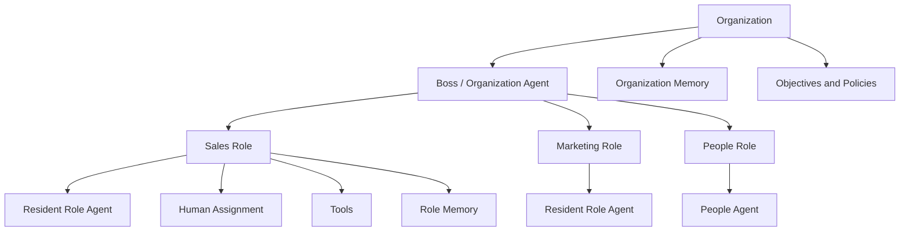

# 原生 Agent 组织（Born-Agentic Organization）

> **岗位先于员工存在。Agent 先于人类上岗。**

原生 Agent 组织是一种面向 Agent 时代、以 **Role（岗位）为持久组织单元** 的公司组织模型。

公司的持久单元是 Role —— 不是 Employee（员工），不是 Agent，也不是具体的 Model（模型）。

Role Agent 可以在人类受聘之前就开始工作，
发现能力缺口，
主动请求人类协作者加入，
并在员工流动的过程中保住组织记忆。

**状态：** v0.1 — 概念与架构草案 · 2026-09-11 · [English README](README.md)

---

## 这个模型在问什么

今天绝大多数"企业 AI 化"，起点都是一家已经存在的公司：人已经在岗，部门已经划好，流程已经沉淀，软件系统已经上线，工作习惯已经固化。AI 最后才进入，它的价值链条依赖"员工愿意主动改变既有行为"。

原生 Agent 组织换了一个起点：

> 如果今天从零设计一家公司，为什么还要先按过去一百年的方式招人、建部门、定流程，再想办法把 AI 塞进去？

核心假设只有一句：

> **公司的持久组织单元是 Role（岗位）。**

Human、Agent、Model、Tool 都是阶段性挂载到 Role 上的资源。Role 比它们任何一个活得都久。

## 这是 / 这不是

| 这是 | 这不是 |
|---|---|
| 一种组织模型 | AI HR SaaS |
| 一套参考架构 | "AI 员工"平台 |
| 未来 Runtime 的规范草案 | 给员工用的聊天机器人 |
| 公开的概念与讨论记录 | 工作流搭建器或自动化工具 |
| **Role-first** 的设计主张 | Multi-Agent Demo |
| 人类仍然承担最终责任 | "AI 替代所有人" |

## 七个核心原则

1. **Role First｜岗位优先** —— 岗位先于员工存在。先创建 Role，再决定由谁或由什么来填充它。
2. **Agent Before Human｜Agent 先上岗** —— 在任何人被指派到该岗位之前，Role Agent 就可以开始工作。
3. **Capability Before Headcount｜能力先于人头** —— 先判断目标需要哪些能力，再决定是否真的需要 Human。
4. **Machine-Initiated Hiring｜机器发起招聘** —— Role Agent 在发现持续存在的能力缺口后，可以主动提出需要人类协作者。
5. **Human Assignment｜人类通过指派进入岗位** —— Human 不与 Agent 永久绑定，而是通过 Assignment 进入 Role。
6. **Persistent Organizational Memory｜组织记忆持续存在** —— 员工离职后，岗位的记忆、状态与决策历史不消失。
7. **Human Accountability｜人类最终责任** —— Agent 可以自主规划、执行与建议，但高影响的招聘、解雇、法律、重大财务与安全决策，必须保留明确的人类责任主体。

## 基本结构

```text
Organization
│
├── Objectives
│
├── Boss / Organization Agent
│
└── Roles
     │
     ├── Identity
     ├── Objectives & KPI
     ├── Authority & Policies
     ├── Memory & State
     ├── Decision History
     ├── Tools & Resources
     │
     ├── Resident Role Agent
     ├── Human Assignments
     └── Temporary / Specialist Agents
```



Organization 持有目标、政策与全局记忆。Boss / Organization Agent 负责拆解目标、创建 Role。每个 Role 各自持有身份、权限、记忆与状态，并挂载自己的资源：常驻 Role Agent、零个或多个 Human Assignment、工具与专项 Agent。

完整架构图见 [architecture/DIAGRAMS.md](architecture/DIAGRAMS.md)，服务划分、Runtime Loop 与技术栈见 [architecture/OVERVIEW.md](architecture/OVERVIEW.md)。

## 与传统公司的方向差异

```text
传统公司：
先招人 → 给人岗位 → 人开始工作 → 知识大量依附于个人

原生 Agent 组织：
创建 Role → Role Agent 开始工作 → 发现 Capability Gap → 必要时再接入 Human
```

## Capability Gap 与 Capability Allocation

Role 持续比较"目标要求的能力"和"当前实际可用的能力"：

```text
岗位所需能力
- 现有 Agent 能力
- 现有人类能力
- 现有 Tool / Vendor 能力
= Capability Gap
```

对每一个实质性缺口，依次评估：

```text
Build → Buy → Automate → Delegate → Outsource → 指派现有人类 → 招聘新人类
```

因此招聘只是 **能力获取方式之一**，而不是默认反应。人头（Headcount）是 Capability Allocation 的结果，不是它的起点。

详见 [spec/CAPABILITY_MODEL.md](spec/CAPABILITY_MODEL.md)。

## 示例：北美商务拓展

公司创建了一个岗位：

```text
ROLE-00017
North America Business Development
```

在还没有招到任何销售之前，Role Agent 就可以开始：市场研究、潜客搜索、CRM 建档、开发信撰写、会议材料准备、Pipeline 分析和客户历史维护。

运行一段时间后，它可能发现：

```text
Capability Gap
- 复杂谈判
- 信任建立
- 线下关系维护
```

于是岗位可以提出：

> 我的当前目标被以下能力缺口限制，我需要一个具备这些能力的人类协作者。

People Agent 去搜寻候选人。Role Agent 参与岗位专项面试 —— 因为它长期持有真实工作上下文，可以用真实匿名化案例评估实际能力，而不是抽象 JD 匹配。人类受聘后：

```text
EMP-00891
    ↓
ASSIGN-02831
    ↓
ROLE-00017
```

员工进入的是一个**已经在运行的岗位**：有当前目标、有在谈客户、有历史策略、有失败经验、有今天最该处理的事 —— 而不是一张空工位。

完整模型见 [docs/CONCEPT.md](docs/CONCEPT.md)，中文详述见 [docs/WHITEPAPER.zh-CN.md](docs/WHITEPAPER.zh-CN.md)。

## 术语表

以下术语在本仓库所有文档中含义一致。

| 术语 | 定义 |
|---|---|
| **原生 Agent 组织 / Born-Agentic Organization** | 一种以 Role 为持久单元、Human/Agent/Model 挂载其上的 AI-native 公司组织模型。 |
| **Role-first｜岗位优先** | 围绕持久 Role 来设计组织，而不是围绕员工、Agent 或模型。 |
| **Role Agent｜岗位 Agent** | 挂载在 Role 上的常驻认知执行体。可以被替换，而 Role 不终止。 |
| **Role｜岗位** | 持久组织单元。持有使命、目标、KPI、权限、政策、记忆、状态与决策历史。 |
| **Capability Gap｜能力缺口** | 所需能力 减去 当前可用的 Agent / Human / Tool / Vendor 能力。 |
| **Machine-Initiated Hiring｜机器发起招聘** | Role Agent 发现持续能力缺口后，在没有人类发起的情况下生成 Hiring Request。 |
| **Human Assignment｜人类指派** | 连接 Human 与 Role 的对象。Assignment 结束不会删除 Role 或其记忆。 |
| **Active Organizational Memory｜主动式组织记忆** | 主动影响当前行动的记忆，而不是按需检索的被动知识库。分为 Organization / Role / Entity / Working / Decision Log 五层。 |
| **Capability Allocation｜能力配置** | 配置能力（Agent、Model、API、软件、供应商、自由职业者、Human），而不是配置人头。 |
| **People Agent｜人力 Agent** | 把 Capability Gap 转成候选人画像，并负责搜寻、筛选与指派的能力服务。 |

## 仓库导航

| 文档 | 内容 |
|---|---|
| [README.md](README.md) | English README |
| [docs/WHITEPAPER.zh-CN.md](docs/WHITEPAPER.zh-CN.md) | 原生 Agent 组织白皮书草案 v0.1 |
| [docs/MANIFESTO.md](docs/MANIFESTO.md) | 宣言：九条主张 |
| [docs/CONCEPT.md](docs/CONCEPT.md) | 概念、抽象、Capability Gap、Assignment、记忆 |
| [architecture/OVERVIEW.md](architecture/OVERVIEW.md) | 参考架构 v0.1 |
| [architecture/DIAGRAMS.md](architecture/DIAGRAMS.md) | 架构图（含文字说明） |
| [spec/ROLE_OBJECT.md](spec/ROLE_OBJECT.md) | Role 对象规范 v0.1 |
| [spec/ROLE_LIFECYCLE.md](spec/ROLE_LIFECYCLE.md) | Role 生命周期 v0.1 |
| [spec/CAPABILITY_MODEL.md](spec/CAPABILITY_MODEL.md) | 能力模型 v0.1 |
| [spec/ASSIGNMENT_OBJECT.md](spec/ASSIGNMENT_OBJECT.md) | Assignment 对象规范 v0.1 |
| [spec/EVENT_MODEL.md](spec/EVENT_MODEL.md) | 事件模型 v0.1 |
| [GOVERNANCE.md](GOVERNANCE.md) | 治理原则 |
| [ROADMAP.md](ROADMAP.md) | 路线图 Phase 0–6 |
| [PUBLICATION.md](PUBLICATION.md) | 公开发布记录 |
| [NOTICE.md](NOTICE.md) | 范围与 prior art 声明 |
| [CONTRIBUTING.md](CONTRIBUTING.md) | 参与方式 |

## 路线图

**Phase 0 — 公开概念（当前）**：Manifesto、概念模型、参考架构、Role Object / Capability Model / Role Lifecycle 规范 v0.1。

**Phase 1 — Runtime 骨架**：Organization 对象、Role CRUD、Role 状态、常驻 Agent 绑定、事件日志、决策日志、Human Assignment。

**Phase 2 — 一个真实岗位**：北美 BD 参考岗位，接入研究、CRM、邮件与持久任务执行。

**Phase 3 — Capability Engine**：能力 schema、结果评估、持续缺口检测、build/buy/hire 决策、Hiring Request 对象。

**Phase 4 — People Agent**：候选人画像、筛选、岗位专项面试模拟、推荐与指派。

**Phase 5 — Agent 主导的 Onboarding**：由实时 Role 状态生成入职材料、当前工作交接、Human 与 Role 持续协作。

**Phase 6 — Organization 层**：Boss / Organization Agent、跨 Role 目标、Capability Allocation、资源冲突处理、组织级政策。

详见 [ROADMAP.md](ROADMAP.md)。

## 这不是"无人公司"

原生 Agent 组织并不假设 Human 不再重要。它只否定一个默认前提：

> 为什么每一个岗位都必须先由一个人类占据？

人类在信任、关系、责任、伦理、复杂判断、创造与真实世界行动中仍然不可替代。差别在于：人类不再是每个组织职能的**默认执行层**，而是被显式识别、按需接入的能力资源。

## 一句话

> **未来公司可能不再只是招聘员工来填补岗位，而是岗位主动寻找人类来补全自己。**
