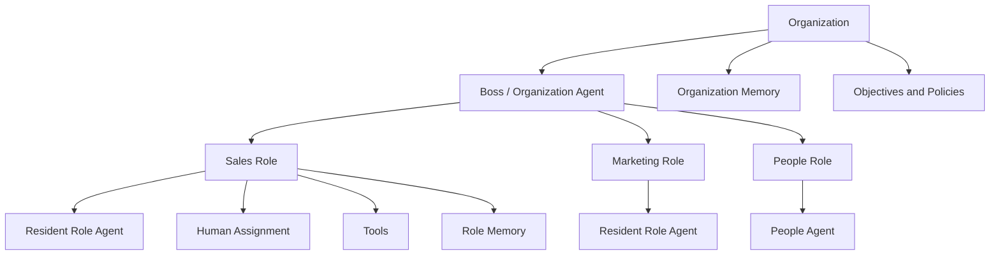
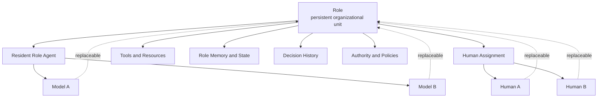
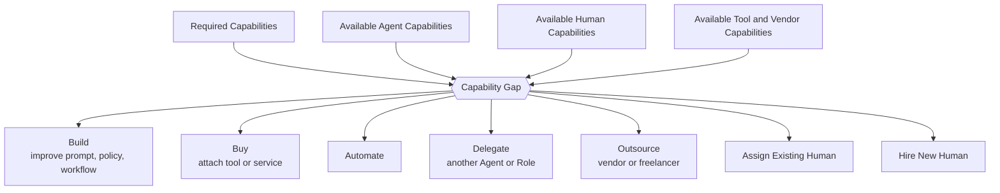
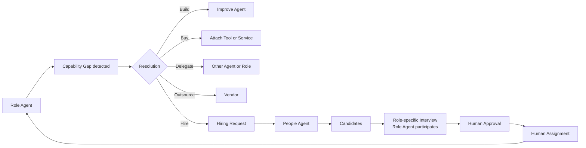
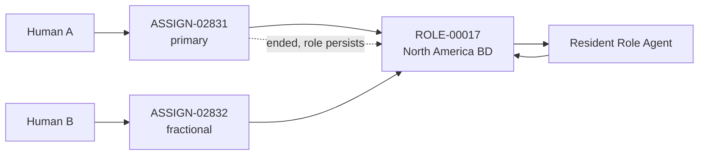
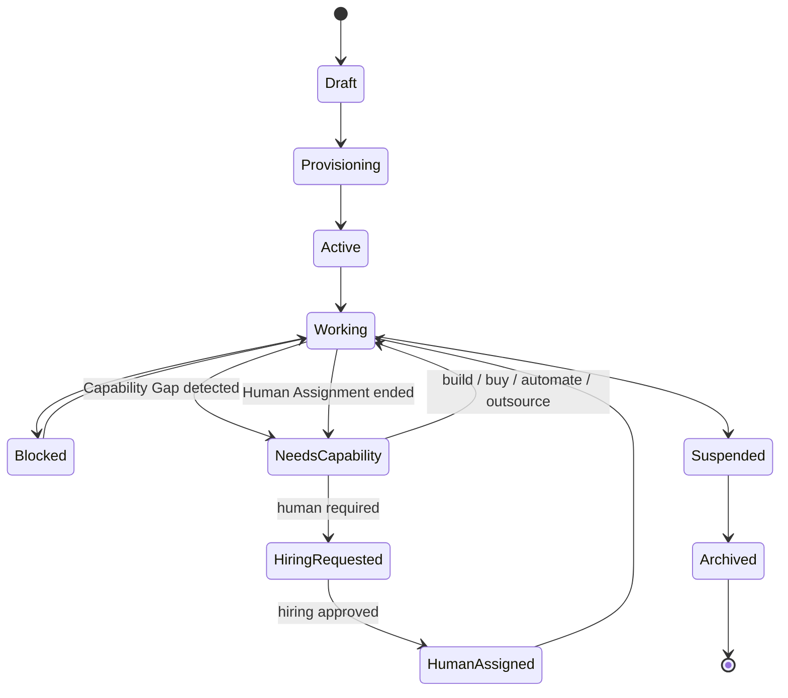
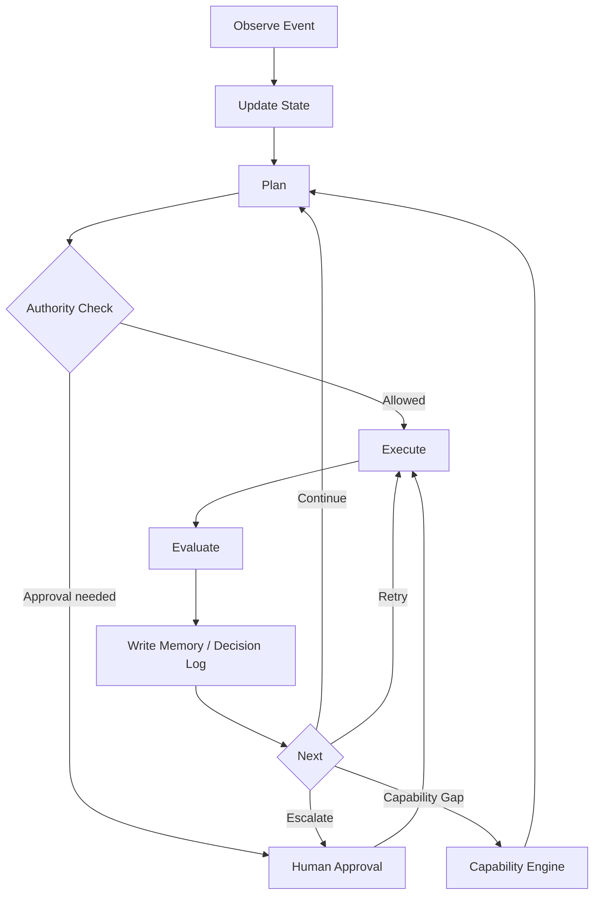

# Architecture Diagrams

All diagrams are Mermaid and render directly on GitHub. Each diagram is followed by a text description, so the structure is readable without rendering and extractable by machines.

Related: [architecture/OVERVIEW.md](OVERVIEW.md) · [spec/ROLE_OBJECT.md](../spec/ROLE_OBJECT.md) · [README.md](../README.md)

---

## 1. Organization → Boss Agent → Roles

**What this shows.** The Organization is the top-level container holding objectives, policies and global memory. The Boss / Organization Agent is an orchestrator, not a super-agent that performs all work: it decomposes objectives, creates Roles and coordinates across them. Every Role is a first-class node with its own resident Role Agent, Human Assignments, tools and memory. The People Role is an ordinary Role that hosts the People Agent — hiring capability is itself organized as a Role.

---

## 2. Role → Agent / Human / Tools / Memory

**What this shows.** The Role sits at the center and owns its own memory, state, decision history, authority and policies. Everything that *executes* is attached: the resident Role Agent (which itself binds to one or more Models), Human Assignments, and tools. The dashed edges mark the core invariant — Models, Agent instances and Humans are all replaceable, and replacing any of them does not terminate the Role or erase its memory.

---

## 3. Capability Gap → Resolution Paths

**What this shows.** A Capability Gap is computed, not assumed — required capabilities minus what Agents, Humans, tools and vendors can currently supply. A gap does not lead directly to hiring. It is routed through the cheapest and most reliable resolution paths first; hiring a Human is the last branch, taken only when the others are insufficient or uneconomic. This is what makes Capability Allocation different from headcount planning.

---

## 4. Machine-Initiated Hiring

**What this shows.** The inversion at the center of the model: hiring can be *initiated by the Role*, not only by a human manager. The Role Agent detects a persistent gap, attempts non-human resolutions first, and only then emits a Hiring Request expressed in capabilities rather than a job title. The People Agent sources candidates; the Role Agent participates in assessment because it owns the real work context. A Human approves the decision, and the Human is then attached back to the same Role through an Assignment — closing the loop.

---

## 5. Human → Assignment → Role

**What this shows.** A Human never *is* the Role — a Human is connected to a Role through an Assignment object. This supports one Role with multiple Humans, one Human across multiple Roles, temporary and fractional assignments, and running a Role with no Human at all. The dashed edge is the key invariant: ending an Assignment (resignation, rotation, contract end) leaves the Role, its memory and its resident Role Agent intact.

See [spec/ASSIGNMENT_OBJECT.md](../spec/ASSIGNMENT_OBJECT.md).

---

## 6. Role Lifecycle

**What this shows.** A Role is created (Draft → Provisioning → Active) and then operates in Working state. A detected Capability Gap moves it to NeedsCapability, which either resolves back to Working through non-human means, or escalates to HiringRequested. A Human leaving returns the Role to Working or NeedsCapability — never to termination. Termination is an explicit organizational action (Suspended → Archived), not a side effect of a Human leaving or a Model being swapped.

See [spec/ROLE_LIFECYCLE.md](../spec/ROLE_LIFECYCLE.md).

---

## 7. Runtime Loop

**What this shows.** The operating cycle of a Role: observe an event, update state, plan, check authority *before* acting, execute, evaluate the outcome, and write both memory and a decision record. Authority is checked in the loop rather than assumed from model capability — that is how Role authority stays separable from what a Model happens to be able to do. Outcomes route back to planning, retry, human escalation, or into the Capability Engine when a gap is the real blocker.

See [architecture/OVERVIEW.md](OVERVIEW.md) and [spec/EVENT_MODEL.md](../spec/EVENT_MODEL.md).
